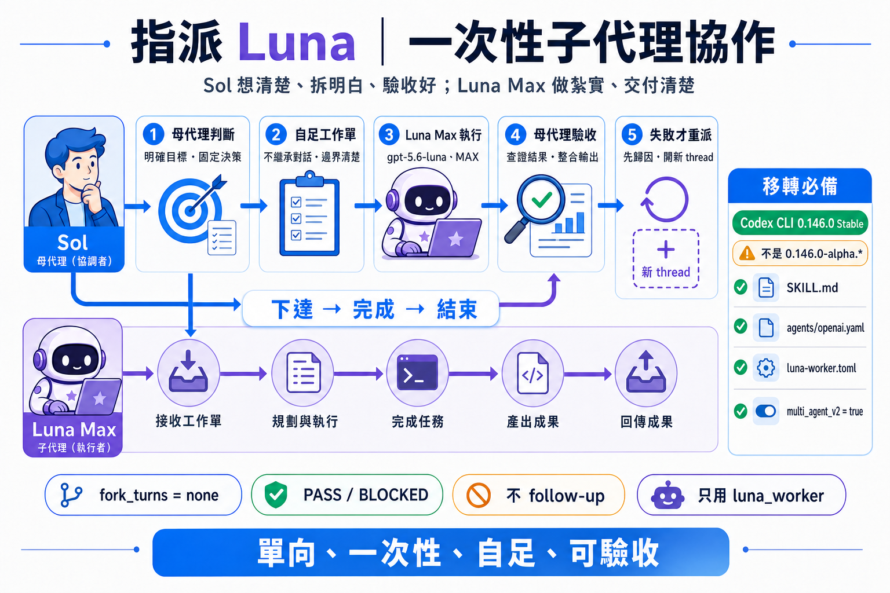

# 指派 Luna

這個倉庫只包含一個 Codex Skill：`delegate-luna`。它要求母代理先完成全局判斷，再以不繼承對話、單向且一次性的自足工作單，把明確、有限、可驗收的工作交給 `gpt-5.6-luna`（Max）執行；母代理負責驗收、整合與失敗歸因。

完整安裝、觸發方式、驗證與疑難排解請見：**[使用說明](USAGE.md)**。

> [!IMPORTANT]
> 可重現基準是正式版 **Codex CLI `0.146.0`**，不是 `0.146.0-alpha.*`。安裝後必須確認實際執行的 App Server 也回報 `0.146.0`，並驗證 `luna_worker` 為 `gpt-5.6-luna`、`max`；不能只看檔名或 npm 套件版本。

## 移轉安裝

1. 把 [`delegate-luna`](delegate-luna) 整個資料夾複製到 `~/.codex/skills/delegate-luna/`。
2. 把 [`delegate-luna/assets/luna-worker.toml`](delegate-luna/assets/luna-worker.toml) 複製到 `~/.codex/agents/luna-worker.toml`；若只想讓單一專案使用，改放在該專案的 `.codex/agents/luna-worker.toml`。
3. 安裝正式版 Codex CLI `0.146.0`，並確認多代理功能已啟用。此 Skill 已在 `multi_agent_v2 = true` 下驗證。
4. 完整重新啟動 Codex，觸發「指派 Luna」或「指派路那」，並確認子代理 runtime 顯示 `gpt-5.6-luna`、`max`。

Skill 目錄裡的 TOML 是方便移轉的來源檔；Codex 實際只會從 `~/.codex/agents/` 或專案 `.codex/agents/` 載入自訂代理。

## 核心原則

- `fork_turns = "none"`
- `母代理下達完整工作單 → Luna 執行、自驗、回報 → thread 結束`
- 不向完成的 Luna thread 發 follow-up；失敗時先由母代理歸因，再開新 thread 重派。
- Luna 只回報 `PASS` 或 `BLOCKED`，母代理仍須獨立驗收。
